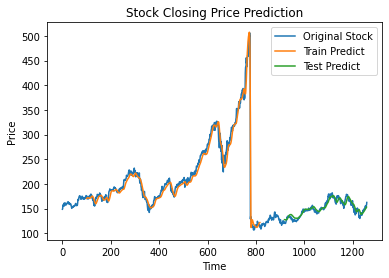
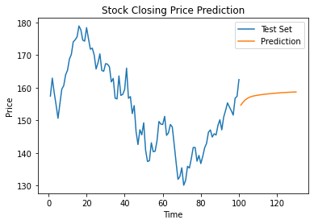

# Stock Price Prediction - Using LSTM

Used Long Short Term Memory (LSTM), a type of Recurrent Neural Network (RNN), to predict the future stock price of Apple Inc. This is an example of time series data model, where I have used the closing price as the input to predict the next 30 days stock price.

RNN are a type of Neural Network where the output from previous step are fed as input to the current step. Traditionally, all the inputs and outputs are independent of each other, but in cases like when it is required to predict the next word of a sentence, the previous words are required and hence there is a need to remember the previous words. 

Long Short Term Memory Network (LSTM) is an advanced RNN, a sequential network, that allows information to persist. 

## Data Collection

For getting started, we need the data. I have used Tiingo API for data collection. 

[Tiingo API](https://api.tiingo.com/)

## Dependencies

- Pandas
- Matplotlib
- Numpy
- Tensorflow
- Math 
- Scikit Learn

For LSTM model, 

From Tensorflow.models, we require Sequential model
From Tensorflow.layers
## Data Visualization

## Training

## Results

Mean Squared Error value = 5.592799685183432

## Predictions

